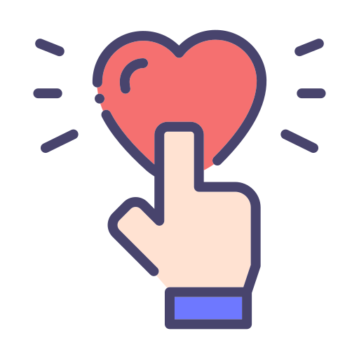

<!-- More info, tips and tricks for making GitHub Profile README can be found in my article at https://towardsdatascience.com/build-a-stunning-readme-for-your-github-profile-9b80434fe5d7 -->
# ✨ Hello, folks!  Welcome to my profile ✨ 

<!--   -->

A kind of swiss army knife (please don't bully me) 🦖

- PhD in Sciences
- MSc. Bioinformatic
- BSc. Computer Sciences
- Bioinformatician
- Software Engineer
- UI/UX Architect
- DevOps Engineer
- Inventor in free time

From old school, where chakra balance made by my mom after told me off :sweat_smile:

Hobbies, I love assembly a puzzle, re-annotate old plasmids (I know..), playing harmonica/guitar, photography, kite surfing and being an archer!

You can find me on in a several platforms highlighted bellow. See my website [here](https://lcerdeira.github.io/portfolio/).

🚀 Problem Lover 

🚀 Innovation Addicted 

:art: Disruptive Innovation 

🚀 Data-driven Approaches 

🚀 Learning lover 

:earth_americas: Renewable Technology 

:honey_pot: Big believer in the power of teams 

 
<!--##  Blog, Social Media, Photography & My podcast available in SoundClound/Spotify (Waiting for new updates)-->

##  Certified Professional

 
 

## License

I don't develop for the money, power, fame, or codebabes. I do it **For pleasure without pressure ✨.** It all started because of an obsession with two words: . 

<!-- links to social media icons -->

<!-- icons with padding -->

[1.1]: http://i.imgur.com/tXSoThF.png (twitter icon with padding)
[2.1]: http://i.imgur.com/0o48UoR.png (github icon with padding)

<!-- icons without padding -->

[1.2]: http://i.imgur.com/wWzX9uB.png (twitter icon without padding)
[2.2]: http://i.imgur.com/9I6NRUm.png (github icon without padding)
[3.2]: https://raw.githubusercontent.com/lcerdeira/lcerdeira/linkedin-3-16.png (LinkedIn icon without padding)

<!-- links to your social media accounts -->

[1]: https://twitter.com/lcerdeira
[2]: https://github.com/lcerdeira
[3]: https://www.linkedin.com/in/louisecerdeira

<!-- Resources MIT Lincense -->
<!-- Icons: https://simpleicons.org/ -->
<!-- GitHub Stats: https://github.com/anuraghazra/github-readme-stats -->
<!-- Emojis: https://emojipedia.org/emoji/ -->
<!-- HTML Emojis: https://www.fileformat.info/index.htm -->
<!-- Shields: https://shields.io/ -->
<!-- Awesome GitHub Profile README: https://github.com/abhisheknaiidu/awesome-github-profile-readme -->
